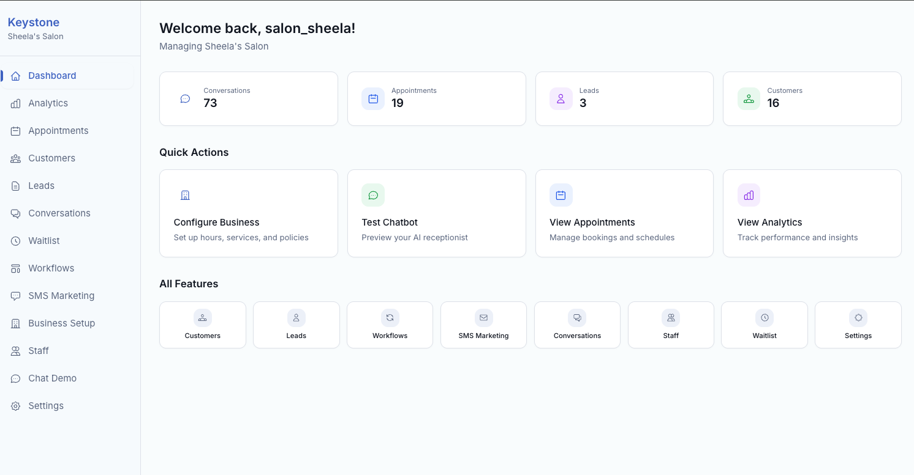
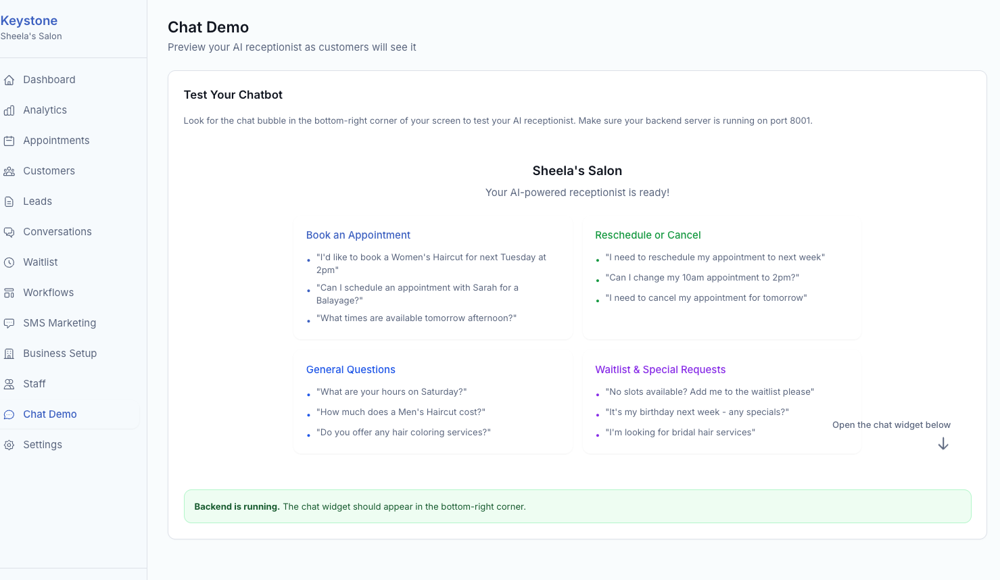

# AI Receptionist - Keystone

AI-powered receptionist chatbot for self-care businesses (salons, medspas, fitness studios, clinics).

## Live Demo

- **Admin Dashboard**: [receptionist-ai.pragnyalabs.com/login](https://receptionist-ai.pragnyalabs.com/login) (Test username: `salon_sheela`)
- **Embedded Chat Widget**: See it in action on a sample salon website at [sheela-salon.pragnyalabs.com](https://sheela-salon.pragnyalabs.com/) (bottom right corner)

## Screenshots

<p align="center">
  
</p>

<p align="center">
  
</p>

[View all screenshots](SCREENSHOTS.md)

## Features

### V1 - Core Features
- **Business Information Queries** - Hours, pricing, services, location, policies, FAQs
- **Embeddable Chat Widget** - Single script tag to add to any website
- **Admin Panel** - Configure business info, manage staff, preview chatbot
- **Industry Templates** - Pre-loaded configs for beauty, wellness, medical, fitness
- **Conversation Context** - Session-based memory for natural conversations

### V2 - Booking & CRM
- **Appointment Booking** - Check availability, book, cancel, reschedule appointments
- **Interactive Booking UI** - Service picker, calendar selector, contact forms in chat widget
- **Customer Recognition** - Identify returning customers, show visit history
- **Lead Capture** - Capture sales inquiries with contact information
- **Waitlist Management** - Add customers to waitlist when no slots available
- **SMS Marketing** - Create campaigns with pre-built templates (holiday, loyalty, referral)
- **FAQ Management** - CRUD operations for business FAQs
- **CSV Import** - Bulk import customers from CSV files

### V3 - Intelligence & Polish
- **Analytics Dashboard** - Leads, appointments, conversations, conversion rates with navigation
- **Conversation History** - View, search, and export chat transcripts (JSON/CSV)
- **Custom Workflows** - Automate responses with keyword triggers, customer segments. Pre-built automations (birthday, bridal, corporate, VIP, new customer)
- **Service Recommendations** - AI suggests services based on customer goals/concerns
- **Cancellation Recovery** - Automatic waitlist notifications when slots open up
- **Search & Filters** - Search appointments by customer name, filter by status/date

### V4 - Business Intelligence (Current)
- **Unanswered Questions Report** - Track questions AI couldn't answer, resolve and add to FAQs with one click
- **FAQ Management Page** - Dedicated interface to view, add, edit, and delete FAQs
- **Website Import** - Extract business info from your website URLs with one-click apply
- **Dashboard Alerts** - Real-time alerts for new leads and unanswered questions needing attention

## Tech Stack

- **Backend**: Python 3.12+, FastAPI, Agno SDK, SQLite
- **Frontend**: React + Tailwind (Admin), Vanilla JS (Widget)
- **AI**: OpenAI GPT-4o-mini

## Quick Start

### 1. Backend Setup

```bash
cd backend

# Install dependencies
uv sync

# Configure environment
cp .env.example .env
# Edit .env and add your OPENAI_API_KEY

# Run server
uv run python -m app.main
```

The API will be available at http://localhost:8000

### 2. Admin Panel Setup

```bash
cd frontend/admin

# Install dependencies
pnpm install

# Run dev server
pnpm dev
```

Admin panel at http://localhost:3000

### 3. Test the Widget

1. Sign up via the admin panel (creates a business)
2. Go to Settings to get your embed code
3. Open `frontend/widget/index.html` in a browser
4. Or add the embed code to any HTML page

## Project Structure

```
receptionist_ai/
├── backend/
│   ├── app/
│   │   ├── api/          # FastAPI routes (auth, chat, business, appointments, leads, analytics, workflows)
│   │   ├── agent/        # Agno agent & prompts
│   │   ├── tools/        # Agent tools (booking, leads, customers, recommendations, workflows)
│   │   ├── repositories/ # Data access layer (all database operations)
│   │   ├── models/       # Pydantic models
│   │   ├── services/     # Business logic (calendar service)
│   │   └── db/           # Database (SQLite)
│   └── data/
│       └── templates/    # Industry YAML templates
├── frontend/
│   ├── widget/           # Embeddable chat widget with structured inputs
│   └── admin/            # React admin panel (dashboard, analytics, conversations, workflows, appointments, etc.)
└── agentic_development_docs/
```

## API Endpoints

### Authentication & Business
- `POST /auth/signup` - Register user & business
- `POST /auth/login` - Login
- `GET /business/{id}` - Get business details
- `PUT /business/{id}/config` - Update config (YAML)

### Chat
- `POST /chat/message` - Send chat message
- `GET /chat/greeting/{id}` - Get greeting
- `GET /chat/history/{business_id}/{session_id}` - Get chat history

### Admin - Staff & Settings
- `GET /admin/{id}/staff` - List staff
- `POST /admin/{id}/staff` - Add staff

### V2 - Appointments
- `GET /admin/{id}/appointments` - List appointments
- `POST /admin/{id}/appointments` - Create appointment
- `PUT /admin/{id}/appointments/{appt_id}` - Update appointment
- `DELETE /admin/{id}/appointments/{appt_id}` - Delete appointment

### V2 - Customers
- `GET /admin/{id}/customers` - List customers
- `POST /admin/{id}/customers` - Create customer
- `POST /admin/{id}/customers/import` - Import customers from CSV

### V2 - Leads & Waitlist
- `GET /admin/{id}/leads` - List leads
- `POST /admin/{id}/leads` - Create lead
- `GET /admin/{id}/waitlist` - List waitlist entries
- `POST /admin/{id}/waitlist` - Add to waitlist

### V2 - Campaigns & FAQs
- `GET /admin/{id}/campaigns` - List SMS campaigns
- `POST /admin/{id}/campaigns` - Create campaign
- `POST /admin/{id}/campaigns/{campaign_id}/send` - Send campaign (mock)
- `GET /admin/{id}/faqs` - List FAQs
- `POST /admin/{id}/faqs` - Create FAQ

### V3 - Analytics
- `GET /analytics/overview/{id}` - Complete dashboard metrics
- `GET /analytics/summary/{id}` - Summary stats
- `GET /analytics/leads/{id}` - Lead statistics
- `GET /analytics/appointments/{id}` - Appointment statistics

### V3 - Conversations
- `GET /conversations/{id}` - List/search conversations
- `GET /conversations/{id}/{session_id}` - Get conversation details
- `GET /conversations/{id}/{session_id}/export` - Export transcript

### V3 - Workflows
- `GET /workflows/{id}` - List workflows
- `POST /workflows/{id}` - Create workflow
- `GET /workflows/{id}/templates` - Get pre-built templates
- `POST /workflows/{id}/{workflow_id}/toggle` - Enable/disable workflow

### V4 - Website Import & Insights
- `POST /business/{id}/scrape` - Scrape multiple URLs and extract business info
- `POST /business/{id}/scrape/apply` - Apply scraped data to business config
- `GET /insights/{id}/unanswered` - List unanswered questions
- `POST /insights/{id}/unanswered` - Log new unanswered question
- `PUT /insights/{id}/unanswered/{qid}/resolve` - Resolve question and optionally add to FAQs
- `DELETE /insights/{id}/unanswered/{qid}` - Delete unanswered question

## Deployment

See [deploy/DEPLOYMENT.md](deploy/DEPLOYMENT.md) for complete deployment instructions covering:
- Backend setup with systemd
- Frontend build and nginx configuration
- SSL/HTTPS setup with Let's Encrypt
- Common operations and troubleshooting

## Documentation

- [PRD & Technical Spec](agentic_development_docs/project_design_plan/2_initial_plan.md)
- [Business Idea](agentic_development_docs/business_plan/0_keystone_business_idea.md)
- [Target Businesses](agentic_development_docs/business_plan/1_target_businesses_keystone.md)