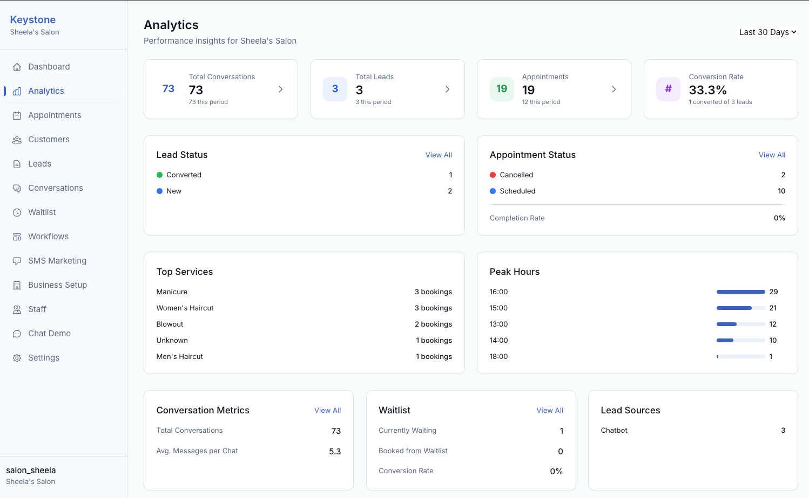
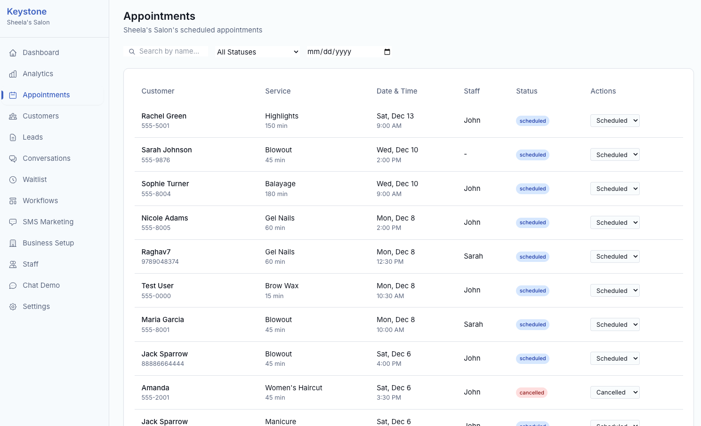
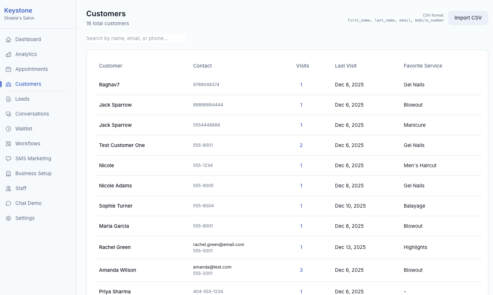
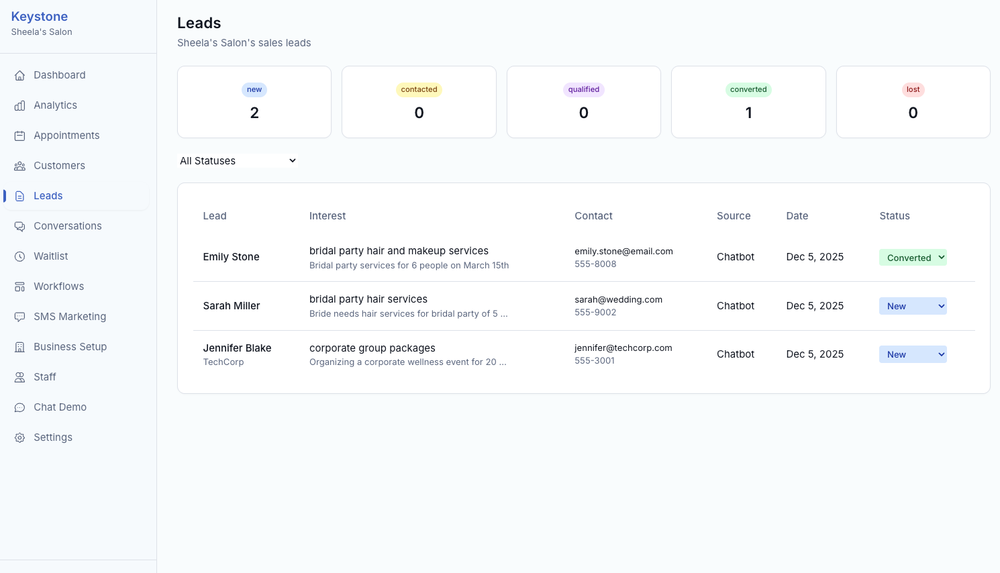
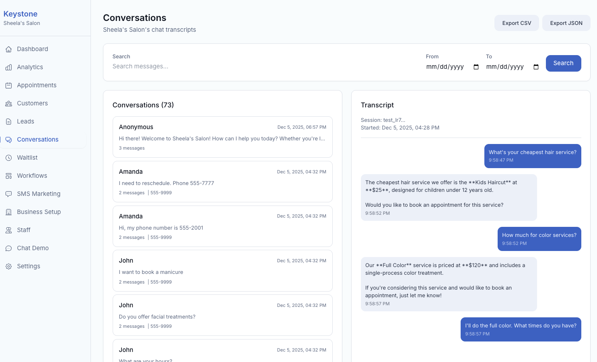
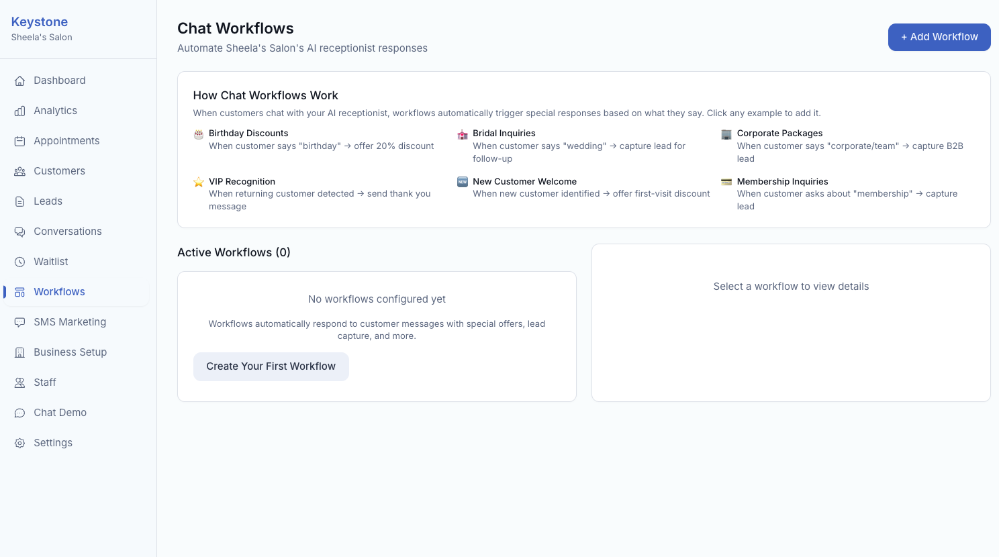
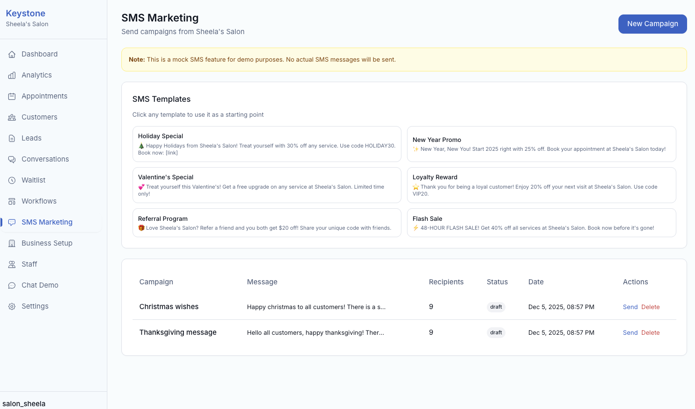
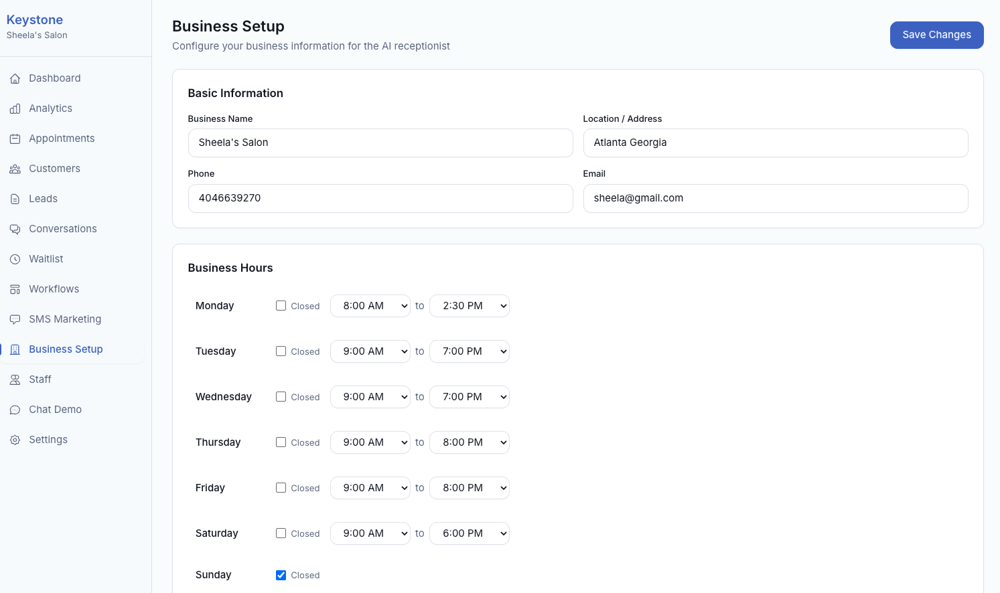
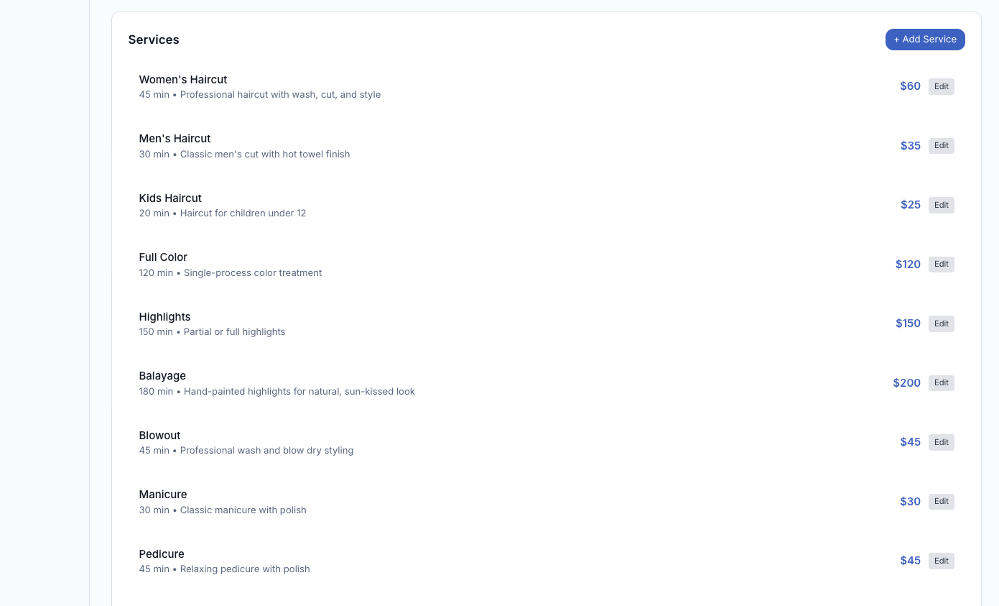
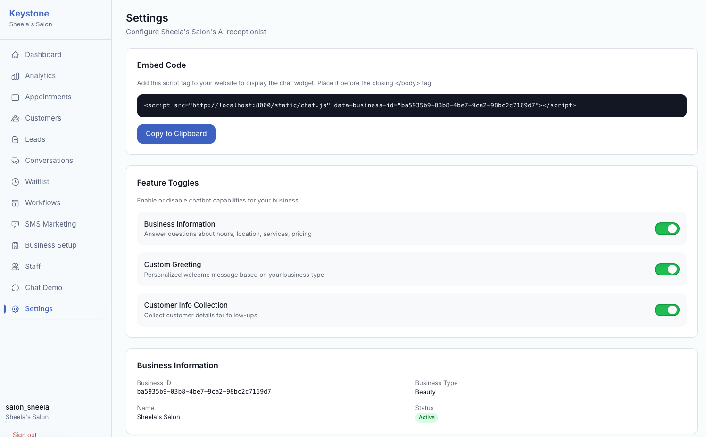

# Screenshots

## Dashboard
Overview of your business metrics and quick actions.

## Analytics
Track leads, appointments, conversations, and conversion rates.

## Appointments
Manage all customer appointments with search and filters.

## Customers
View customer database with visit history and favorite services.

## Leads
Track and manage sales leads from chatbot conversations.

## Conversations
Search and view chat transcripts with export options.

## Workflows
Automate responses with keyword triggers and customer segments.

## SMS Marketing
Create and send marketing campaigns with pre-built templates.

## Business Setup
Configure your business information and hours.

## Services
Manage your service menu with pricing and duration.

## Staff Management
Add and manage team members.

## Chat Demo
Test your AI receptionist chatbot.

## Settings
Configure embed code and feature toggles.

